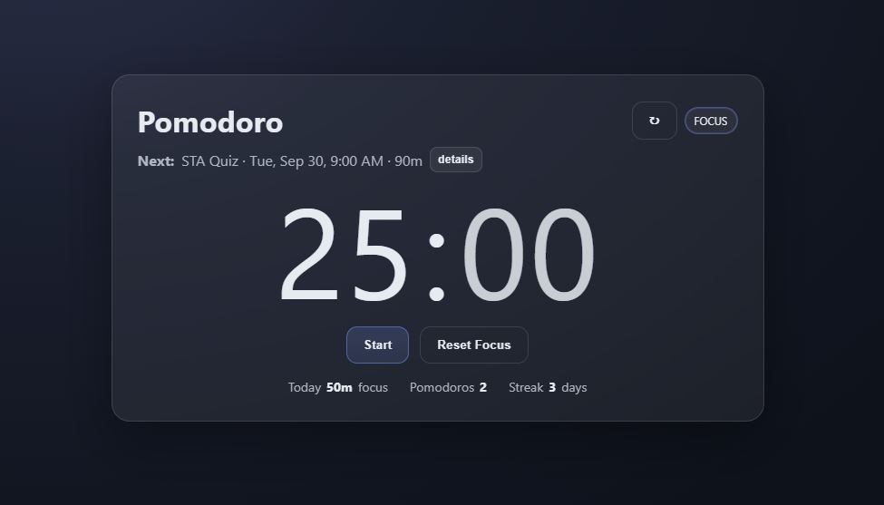
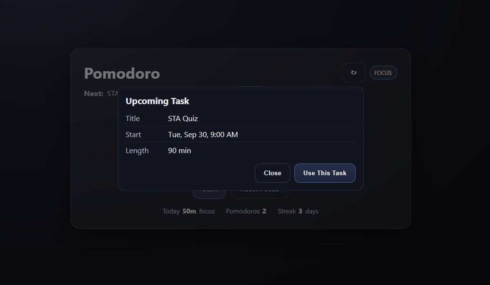

# Life Forge

Life Forge is a lightweight productivity app featuring a Pomodoro timer and a Notion proxy integration.  
The goal is to combine focused work sessions with seamless task management.

## Contents
- `life-forge-hub/` — Pomodoro timer with focus/break modes and local stats
- `notion-proxy/` — integration layer that connects to Notion tasks

## Features (current)
- Focus and break timer with start, pause, reset, and skip controls
- Inline duration editing with input validation
- Local storage of daily focus stats and history
- Pulls the "next task" from Notion for direct focus

## Preview
### Timer


### Tasks


## Future Roadmap
- Task manager to organize and time-block tasks from Notion  
- Automatic scheduling based on priority and deadlines  
- Analytics dashboard for focus streaks and long-term trends  
- Cross-platform builds (desktop + mobile)  
- Additional integrations (Google Calendar, Discord, etc.)

## How to Run
```bash
git clone https://github.com/yourusername/life-forge.git

cd life-forge

npm install

npm run dev
